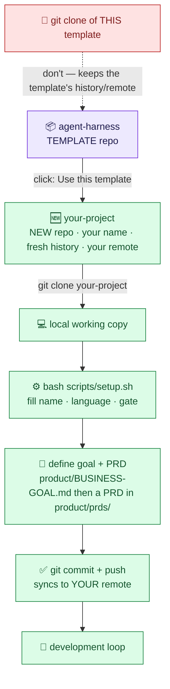
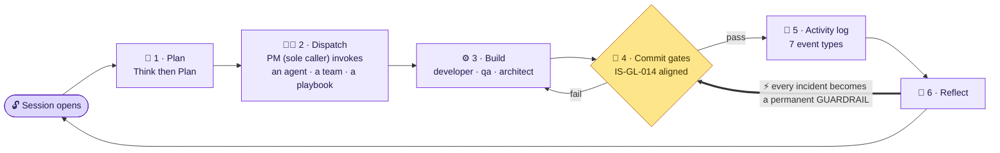

<div align="center">

# 🛠️ Milaha Agent Harness

**Milaha's shared scaffold for governed, AI-assisted software delivery.**

*A reusable starting structure so any Milaha software team can build with AI at startup speed —
while keeping the audit trail, version discipline, security governance, and design consistency that
Milaha standards require.*

</div>

---

> **The harness is the factory behind the product, not the product itself.**
> This repository is that factory — proven on **two live Milaha builds in different domains and
> different languages: OceanMate** (TypeScript, maritime operations) and **Taxera** (Python, e-invoicing
> compliance). Each arrived at nearly the same harness independently, and patterns proven on one were
> adopted by the other. What survived that re-expression is what you adopt here.

---

## For leadership — why this matters to Milaha

| Milaha gets… | How |
|---|---|
| **Speed *with* control** | A solo developer + AI agents can ship at startup pace while keeping an audit trail, version discipline, and security governance aligned to **IS-GL-014 / IS-ST-003 / IS-ST-004**. |
| **Reuse across projects** | The same harness already runs OceanMate and Taxera. A third Milaha team starts from this template instead of re-earning the structure over months. |
| **Institutional memory** | An append-only activity log captures *why* decisions were made — knowledge stays even when people move. |
| **Audit & compliance by construction** | Security governance, an AI-system inventory, and a secure-coding posture are part of the harness, not a review bolted on at the end. |
| **Proven, not theoretical** | The cross-project transfer is visible in git history — e.g. Taxera absorbed OceanMate's security-governance harness (2026-05-23; commits #139 / #140 / #145). |

> **One line for the committee:** *"The way we build is now a reusable Milaha asset — governed,
> auditable, and proven across two products."*

---

## What it is (the short version)

Seven cooperating layers, adopt-as-you-need:

| Layer | Folder | What it does |
|---|---|---|
| 🧑‍💼 **Agents** | `.claude/agents/` | Role-specialized AI agents; one **PM orchestrator** is the *sole caller* so the audit trail never fragments |
| 👥 **Teams** | `.claude/teams/` | Agent subsets the PM dispatches together |
| 📋 **Playbooks** | `.claude/playbooks/` | Reusable workflows (sprint, version-bump, incident, worktree isolation) |
| 🪝 **Hooks** | `.claude/hooks/` | Session-open context, single-writer lock, destructive-command guard |
| 📊 **Harness** | `harness/` | Append-only activity log (7 event types) + stdlib dashboard |
| 🚦 **Gates** | `gates/` | Commit-time enforcement, dual-stack: `lefthook` (TS) + `pre-commit` (Python) |
| 🔐 **Compliance** | `compliance/` | Phase A–D governance pre-aligned to **Milaha security standards** |

📖 **Full story & rationale:** [`docs/harness-engineering.md`](./docs/harness-engineering.md) — how it
started, the architecture, the OceanMate ⇄ Taxera co-evolution, and the trial-and-error lessons.

---

## How to start — it becomes *your* repo

> ⚠️ **Don't `git clone` this template directly.** Click GitHub's **"Use this template"** — it creates
> *your own* new repository: **your project name, a fresh git history, your own remote.** Cloning the
> template would tie you to the template's history and remote. You want an independent repo that syncs
> to your team's git.



## For engineering — step by step

### Step 0 · Create your repo from the template
On GitHub: **"Use this template" → Create a new repository** under the Milaha org, named after your
project. Then clone **your new repo** (not this one) and `cd` in.

### Step 1 · Fill the blanks
```bash
bash scripts/setup.sh        # prompts for project name, language, gate engine, domain role, etc.
```
Project-identity values are `{{TOKENS}}`; the Milaha **governance baseline** (security standards,
English-only, review cadence) is already wired in. See [`TEMPLATE_VARS.md`](./TEMPLATE_VARS.md).

### Step 2 · Define the goal & PRD — *before building* 🎯
Fill [`product/BUSINESS-GOAL.md`](./product/BUSINESS-GOAL.md), then **register a PRD**: copy
[`product/PRD-TEMPLATE.md`](./product/PRD-TEMPLATE.md) → `product/prds/NNNN-<slug>.md` and list it in
[`product/prds/INDEX.md`](./product/prds/INDEX.md). One goal, many PRDs.
Drive it with the [`discovery-to-prd`](./.claude/playbooks/discovery-to-prd.md) playbook in Claude
Code: the **PM agent interviews you** for the goal → the **domain specialist drafts the PRD** →
**architect reviews** → the PM writes the plan in `docs/plans/`. *Nothing gets built until the PRD
names the goal it serves.*

### Step 3 · Turn on commit gates (pick your stack)
```bash
# TypeScript
cp gates/typescript/lefthook.yml ./lefthook.yml && lefthook install
# Python
cp gates/python/.pre-commit-config.yaml ./ && pre-commit install
```
Same logical gates both ways: secret scan, sensitive-file block, lint, type/format, version-sync, and
the **IS-GL-014 governance gate**. Bypass = `<NAME>_BYPASS=1`, documented in the commit.

### Step 4 · Wire the session hook
Edit `.claude/hooks/session-open.sh`: set `REFERENCE_DIRS` to your standards / ADR / `product/` folders.

### Step 5 · First run + sync your git
```bash
python3 harness/scripts/build_dashboard.py
git add -A && git commit -m "chore: initialize from harness template" && git push
```

### Step 6 · Tailor the team & keep it clean
Rename/trim agents (keep the **sole-caller** rule). Before each commit:
```bash
bash scripts/check_internal.sh    # blocks real secrets / customer / vessel / financial data
```

> See [`SETUP.md`](./SETUP.md) for the detailed walkthrough.

---

## The development process (the loop)



*(The bold `===>` edge from Reflect back to the gate is the engine — every incident becomes a permanent guardrail.)*

**The six steps**

| # | Step | What happens |
|:-:|---|---|
| 🔓 | **Session opens** | the hook prints branch state, dashboard, and open assumptions |
| 🧠 | **Plan** | the PM plans *before* any code (Think → Plan) |
| 🧑‍💼 | **Dispatch** | the PM — the **sole caller** — invokes an **agent**, a **team**, or a **playbook** |
| 🚦 | **Commit gates** | secret scan · lint · version-sync · **IS-GL-014** governance — *fail → fix → re-commit* |
| 📓 | **Activity log** | each agent appends one of 7 event types; the dashboard refreshes |
| 🔁 | **Reflect** | at cycle close — and the loop turns again |

> **⚡ The engine is the bold orange edge.** Every incident is encoded as a **permanent gate**, so it
> can never recur silently. That feedback loop is *why* the harness is **project-specific and never
> finished**. Full diagram + role table in [`docs/harness-engineering.md`](./docs/harness-engineering.md).

---

## Milaha governance baseline (already wired)

- **Security standards:** the `security-officer` agent + `compliance/` map controls to **IS-GL-014 /
  IS-ST-003 / IS-ST-004**; the AI-system inventory (`harness/AI_INVENTORY.yaml`) carries the
  semi-annual review cadence (IS-ST-004).
- **Secure Coding:** the commit gate references the Milaha Secure Coding Checklist (by reference — the
  checklist itself is **not** copied here).
- **Separation of duties:** the security-officer owns policy; implementation (auth, kill-switch, DLP)
  stays with developer/architect via the PM. The auditor does not write the audited code.
- **English-only repo policy** and the **single-PM-writer** lock are on by default.

> 🔒 **Internal hygiene:** this is an internal Milaha repo, so naming our standards and projects is
> fine — but it carries **no real customer / vessel / financial data and no secrets**. Reference
> standards by ID; keep operational data in the product repos. `scripts/check_internal.sh` guards this.

---

## Repository layout

```text
📦 agent-harness/
│
├── 📖 README · SETUP · TEMPLATE_VARS · PROVENANCE · LICENSE   … docs & how-to
├── 📚 docs/harness-engineering.md      … the full explainer (story · architecture · co-evolution · lessons)
├── 🎯 product/                         … the WHY — BUSINESS-GOAL.md · PRD-TEMPLATE.md · prds/ (register PRDs)
├── 🧭 CLAUDE.md                        … the charter the AI reads first
├── 🏷️  VERSION · CHANGELOG.md           … version source-of-truth + history
│
├── 🤖 .claude/                         … the AI team
│   ├── agents/      pm (sole caller) + architect · developer · qa · security-officer · designer · ops · domain-sme
│   ├── teams/       delivery · discovery · governance · release
│   ├── playbooks/   discovery-to-prd · sprint-cycle · version-bump · incident-response · security-incident · worktree-isolation
│   ├── hooks/       session-open · pm-write-lock · block-reset-hard · post-agent-dashboard
│   └── settings.json
│
├── 📊 harness/                         … PM plumbing
│   ├── logs/                append-only activity log (7 event types)
│   ├── AI_INVENTORY.yaml     AI-surface inventory  ·  IS-GL-014 / IS-ST-004
│   └── scripts/             build_dashboard.py (stdlib)  +  governance/ (Phase A–D)
│
├── 🚦 gates/                           … commit-time enforcement — pick one
│   ├── typescript/lefthook.yml
│   └── python/.pre-commit-config.yaml
│
├── 🔐 compliance/                      … POSTURE · BACKLOG · OWNERS  →  mapped to IS-GL-014 / IS-ST-003 / IS-ST-004
│
└── 🛠️  scripts/                        … setup.sh (fill the blanks)  ·  check_internal.sh (confidentiality gate)
```

## Requirements
`git`, `python3` (harness scripts are stdlib-only), `bash`, `jq`, plus `lefthook` (TS) or
`pre-commit` (Python). Optional `gitleaks`.

## Questions / ownership
Maintained by the OceanMate / Taxera engineering practice. For adoption help, open an issue in this
repo or reach the maintainers internally.

---

<div align="center">

*Internal Milaha asset · private. Proven on OceanMate + Taxera.*

**The way we build is the proof of what we built.**

</div>
